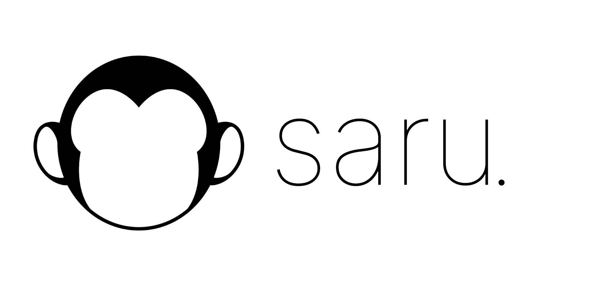

# saru

## Inspiration

Machine learning has allowed computers to understand the world through vision and language like never before. However, the proliferation of such algorithms has led to increased abuse. 

In the United States, at least one in four law enforcement agencies are able to use facial recognition technology with little oversight. Increasingly, governments have used machine learning algorithms to crack down on protests by using facial recognition algorithms to identify and retaliate against protestors.

Additionally, the advancement of powerful language models provides an opportunity for oppressive regimes around the world to better detect and retaliate against messages spread by political activists.

Thus, we made saru to help protect protestors' social media posts from government retaliation and censorship. 

(The name *saru* comes from the Japanese word for *monkey*, inspired by the three wise monkeys Mizaru - see no evil, Kikazaru - hear no evil, and Iwazaru - speak no evil)

## What it does

With saru, one can easily upload an image and caption to our website. Using state-of-the-art adversarial attacks, we'll slightly modify the pixels in your image and the language in your caption to avoid facial recognition and sentiment analysis algorithms, allowing you to express your opinion without fear. 

## How we built it

saru utilizes two grey-box adversarial attacks, one for avoiding facial recognition and one for avoiding sentiment analysis. We transfer a projected-gradient-descent attack tuned on a FaceNet model to modify the input image to prevent facial matching between the input image and a database of identities. To modify the caption, we use the novel TextFooler algorithm to flip the predicted sentiment of a caption, thus avoiding governmental detection.

## What we learned

We're proud of creating such a technically difficult project. Adding two novel machine learning techniques into our backend and ultimately integrating everything into one cohesive project was difficult but rewarding.

We've learned a lot about how frighteningly good machine learning models today are but how adversarial attack methods can subvert such models.
